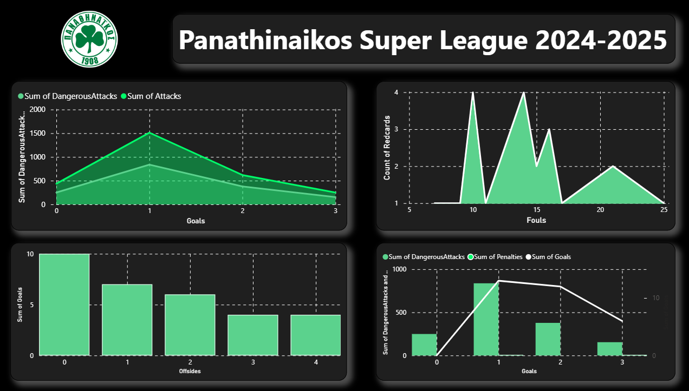

# Panathinaikos SuperLeague Analysis 2024–2025


## Project Overview

This project presents a Power BI dashboard analyzing the performance of Panathinaikos FC during the Greek Super League 2024–2025 season.
The report includes several key performance indicators (KPIs) and visualizations, created using DAX measures and data loaded from CSV files.

## Key Features

- Total attacks

- Dangerous attacks

- Goals scored

- Offsides statistics

- Fouls and red cards

- General performance metrics and interactive visuals

## How to Use

1. Clone this repository:

```bash
git clone https://github.com/timosvar/Case-Study-Panathinaikos.git
```

2. Open the .pbix file with Power BI Desktop.

3. Explore the report and interact with the visualizations.

## Technologies

- Power BI

- DAX Measures

- CSV Data Sources

## Dashboard Preview



## Credits

This project was created as part of a **Workearly course**.